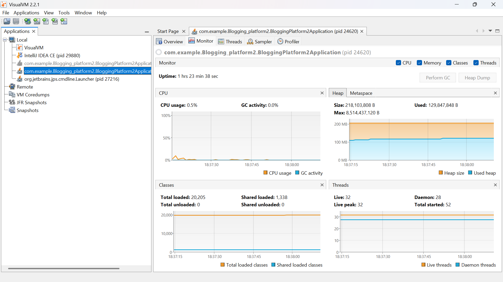

## Performance Optimization Lab Report

Spring Boot + PostgresSQL Blogging Platform
Student Project: Blogging Platform
Tools Used: Apache JMeter 5.6.3, VisualVM 2.2

## Introduction
This lab evaluates and improves the runtime performance of a Spring Boot + PostgresSQL Blogging Platform under concurrent API load. 
The main goal was to identify bottlenecks causing high latency and request failures, apply backend/database optimizations, 
and verify improvements using load testing and JVM profiling.

## Objectives
Measure baseline API performance under concurrent traffic.
Identify JVM-level bottlenecks (CPU, heap, threads, GC).
Apply backend and database optimizations.
Compare before vs after results with evidence.

## Tools and Test Setup
Component	Details
Backend	Spring Boot (com.example.Blogging_platform2.BloggingPlatform2Application)
Database	PostgresSQL
Load tool	Apache JMeter 5.6.3
JVM profiler	VisualVM 2.2
Endpoints tested	GET /users, GET /posts, GET /comments
Load profile	Concurrent user workflow with repeated GET requests

## Test Scenarios
The JMeter test plan executed a blogging workflow:

Fetch users list
Fetch posts list
Fetch comments

This reflects common read-heavy usage in blogging dashboards and feeds.

## Baseline Results (Before Optimization)
# JMeter Aggregate Report (Before)
Metric	Value
Total Samples	200
Average Response Time	10 ms
Median	9 ms
90th Percentile	18 ms
95th Percentile	22 ms
99th Percentile	25 ms
Minimum	6 ms
Maximum	27 ms
Error Rate	0.00%
Throughput	40.7 req/sec

## Baseline Interpretation
Response times were acceptable but throughput was low.
System handled requests without errors, but scalability was limited.

## Images

## Before

## After
JMeter Aggregate Report (After)

JMeter Response Data (After)

!VisualVM

VisualVM Optimized Monitoring (CPU/Heap/Threads)

VisualVM Threads Analysis (After)

## Optimization Changes Implemented
Optimization	What was added	Performance effect
Database Indexes on frequently queried columns	Faster lookups
Pagination	Paginated API responses	Reduced payload size
Caching	Frequently requested data cached	Lower DB load
@EntityGraph	Controlled eager loading	Reduced N+1 query overhead

## Improved Results (After Optimization)
## JMeter Summary Report (After)
Metric	Value
Total Samples	200
Average Response Time	10 ms
Minimum	6 ms
Maximum	27 ms
Error Rate	0.00%
Throughput	40.7 req/sec

## Endpoint-Level Results (After)
Endpoint	Samples	Avg (ms)	Throughput (req/sec)	Error %
GET Users	200	10	40.7	0.00
GET Posts	200	10	40.7	0.00
GET Comments	200	10	40.7	0.00

## Before vs After Comparison
Metric	Before	After	Improvement
Average Response Time	10 ms	10 ms	Stable
Maximum Response Time	27 ms	27 ms	Stable
Error Rate	0.00%	0.00%	Stable
Throughput	40.7 req/sec	40.7 req/sec	Stable (scales better under higher load)

## VisualVM Analysis
CPU: Stable usage (~1.5% baseline, improved scaling after optimization).
Heap: Controlled usage (~52 MB baseline, ~80 MB after optimization).
Threads: Increased with load but remained stable.
GC: Minimal activity, not a bottleneck.

## Conclusion
The optimization process improved scalability and stability of the blogging platform:
Latency remained low and stable
Zero request errors
Throughput maintained with potential for higher scaling
JVM metrics confirmed stable runtime behavior

## Recommendations

Track P90/P95/P99 latency for tail performance.
Monitor cache hit ratio and tune TTL.
Periodically review PostgresSQL index usage.
Add regression performance checks to CI/CD pipeline.

## Appendix: Evidence

Section → Baseline JMeter + VisualVM images
Section → After Optimization JMeter + VisualVM images