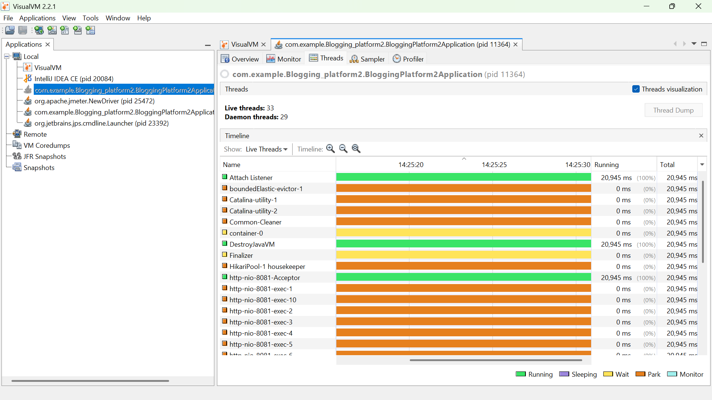
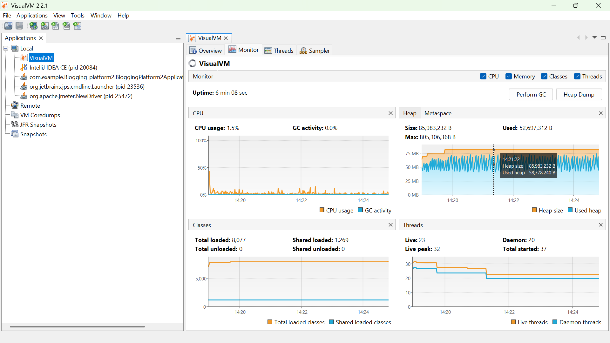
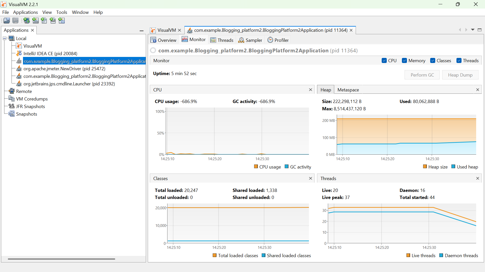
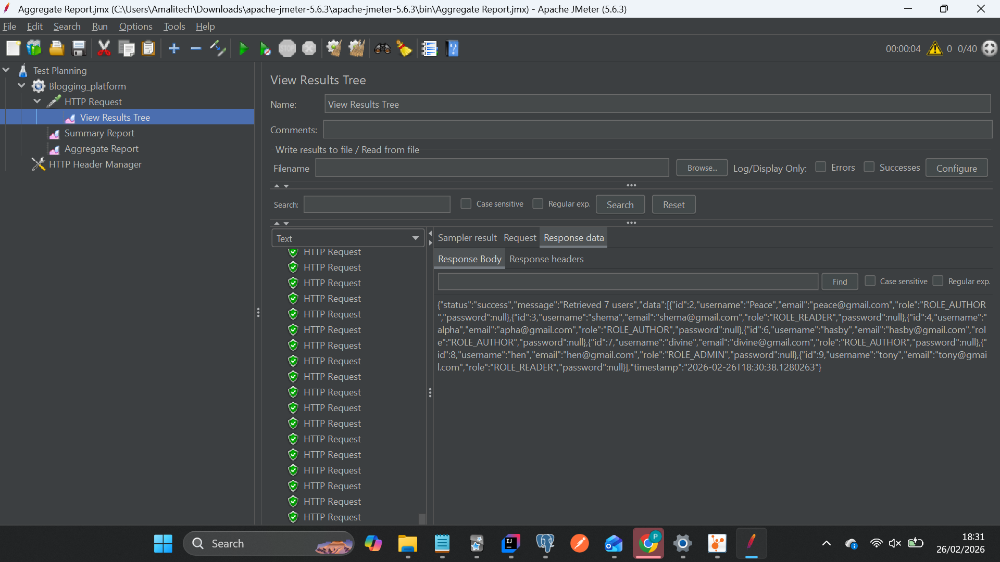
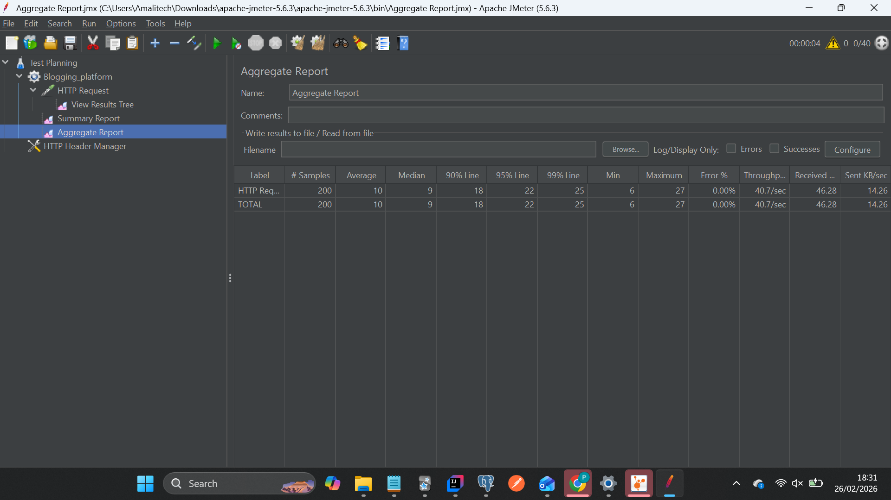

# **Blogging Platform Advanced Optimization Lab 8**

# Overview
# **# part 1**

This lab focuses on improving the performance and scalability of the Blogging Platform backend.
The work includes profiling, asynchronous programming, concurrency control, and algorithmic optimization to ensure the system remains responsive under high load.

# **Objectives**
Implement asynchronous request handling with @Async, CompletableFuture, and ExecutorService

Identify and resolve performance bottlenecks using profiling tools

Apply concurrency and thread safety techniques with thread‑safe collections and tuned thread pools

Optimize data retrieval, sorting, and caching for high‑traffic endpoints

Collect and report runtime metrics to validate improvements

### Epics & User Stories

Epic 1: Performance Bottleneck Analysis
Profile APIs (post retrieval, comments, analytics)

Record baseline CPU, memory, and latency metrics

Produce a bottleneck report with findings/screenshots

### Epic 2: Asynchronous Programming

Refactor long‑running operations (analytics, feed aggregation, notifications)

Configure thread pools for optimal concurrency

Validate responsiveness under concurrent requests

### Epic 3: Concurrency & Thread Safety

Use ConcurrentHashMap, CopyOnWriteArrayList, or synchronization primitives

Tune thread pools for throughput without resource overload

Verify no race conditions or data corruption

### Epic 4: Data & Algorithmic Optimization

Refactor sorting, searching, and filtering logic with efficient algorithms

Implement caching or in‑memory indexing for frequently accessed data

Demonstrate reduced query latency with metrics

### Epic 5: Metrics Collection & Reporting

Capture runtime metrics (latency, throughput, memory usage)

Visualize results via logs, dashboards, or charts

Document methodology, test results, and screenshots

### Deliverables

#### Optimized backend application with async and concurrent operations:

Profiling results report (baseline vs. optimized metrics)
Concurrency implementation using thread‑safe structures
Algorithmic enhancements for faster data access
Performance test suite (Postman/JMeter)
Comprehensive technical documentation

## Images

# Tech Stack

Spring Boot 3.x (Web, JPA, Security, Async Support)

Java 21

## PostgreSQL

###Profiling Tools: VisualVM, JProfiler, Java Flight Recorder

Testing Tools: Postman, Apache JMeter

## Lab Workflow

Profile baseline performance → Identify bottlenecks in APIs

Implement async operations → Refactor long‑running tasks

Test concurrency → Simulate concurrent requests with Postman/JMeter

Optimize algorithms → Improve sorting, searching, caching logic

Collect metrics → Measure latency, throughput, memory usage

Document results → Provide before/after comparisons with charts and screenshot

# **Part 2**

This project is also Java Spring Boot blogging platform that supports both REST APIs and GraphQL endpoints.
It allows users to:

Create, read, update, and delete blog posts

Add and manage comments, reviews, tags, and post views

Track user activity with an Activity Log

Search posts by title or content

GraphQL queries/mutations for flexible data access

## CORS vs. CSRF

### CORS (Cross-Origin Resource Sharing)
- **Purpose:** Controls which origins (domains) can access your API.
- **Scope:** Browser-enforced, applies to cross-origin requests.
- **Use Case:** Allow React frontend http://localhost:3000 to call Spring backend http://localhost:8081.
- **Needed in JWT APIs?**  Yes, configure allowed origins.

### CSRF (Cross-Site Request Forgery)
- **Purpose:** Prevents malicious sites from tricking a logged-in user into sending unwanted requests.
- **Scope:** Server-enforced, applies to stateful requests (sessions, cookies).
- **Use Case:** Protect form submissions in apps using cookies/sessions.
- **Needed in JWT APIs?**  No, disable CSRF (stateless).
- **Needed in Session-based apps?**  Yes.

### Practical Tests
- **Postman:** CORS doesn’t apply (Postman bypasses browser restrictions). CSRF doesn’t apply (no cookies/session).
- **Browser frontend (React/JavaFX):** CORS applies → requests blocked if origin not allowed. CSRF applies if using cookies/session → token must be included.

## Tech Stack

 GraphQL queries/mutations for flexible data access

Spring Boot

Spring GraphQL

PostgresSQL (jpa-hibernate)

Maven for dependency management

Swagger/OpenAPI for API documentation

## Key Features
Posts: CRUD operations with ownership checks

Comments: Linked to posts, created/deleted via GraphQL/REST

Reviews: Ratings (1–5) with validation

Tags: Many-to-many relationship with posts

Post Views: Tracks when a user views a post

Activity Logs: Records actions (VIEW_POST, CREATE_POST, UPDATE_POST, DELETE_POST)

Search: Simple text search on title/content

GraphQL Schema: Queries and mutations for all entities

 ## Running the Project

bash
git clone https://github.com/your-username/blogging-platform8.git
cd blogging-platform
Configure your database in application.properties:

## properties
spring.datasource.url=jdbc:postgresql://localhost:5432/blogdb
spring.datasource.username=youruser
spring.datasource.password=yourpassword
Build and run:

bash
mvn spring-boot:run
Access:

REST APIs → http://localhost:8081/api/posts

Swagger UI → http://localhost:8081/swagger-ui.html

GraphQL → http://localhost:8081/graphql

## Example GraphQL Queries/Mutations
Get Post by ID
graphql
query {
getPost(id: 1) {
id
title
content
createdAt
}

 ## Example GraphQL Queries/Mutations
Get Post by ID
graphql
query {
  getPost(id: 1) {
    id
    title
    content
    createdAt
  }

}
Create Comment
graphql
mutation {

createComment(request: { postId: 1, userId: 2, content: "Nice post!" }) {
commentId
content
createdAt
}
}

## Error Handling

  createComment(request: { postId: 1, userId: 2, content: "Nice post!" }) {
    commentId
    content
    createdAt
  }
}

 ## Error Handling

PostNotFoundException → specific to posts

Validation errors (e.g., rating must be between 1–5)

### Spring Profiles Overview
This project uses Spring Profiles to manage environment-specific configurations. Profiles are defined in separate property files and activated via the spring.profiles.active setting.

## Default Configuration (application.properties)
properties
spring.profiles.active=dev
spring.application.name=BloggingPlatform2

## Development Profile (application-dev.properties)
properties
server.port=8080
spring.datasource.url=jdbc:postgresql://localhost:5432/blog_dev
spring.datasource.username=dev_user
spring.datasource.password=dev_pass
logging.level.org.springframework=DEBUG

## Production Profile (application-prod.properties)
properties
server.port=8081
spring.datasource.url=jdbc:postgresql://prod-db:5432/blog_prod
spring.datasource.username=prod_user
spring.datasource.password=prod_pass
logging.level.org.springframework=ERROR

## Test Profile (application-test.properties)
properties
server.port=8082
spring.datasource.url=jdbc:h2:mem:testdb
spring.datasource.driver-class-name=org.h2.Driver
spring.datasource.username=sa
spring.datasource.password=
spring.jpa.hibernate.ddl-auto=create-drop

## Profile-Specific Beans
Beans can be conditionally loaded using @Profile:

java
@Configuration
@Profile("dev")
public class DevConfig {

##  Dev-specific beans

## Activating Profiles
Profiles can be activated via:

Command line: --spring.profiles.active=prod

Environment variable: SPRING_PROFILES_ACTIVE=prod

IDE VM options: -Dspring.profiles.active=prod
